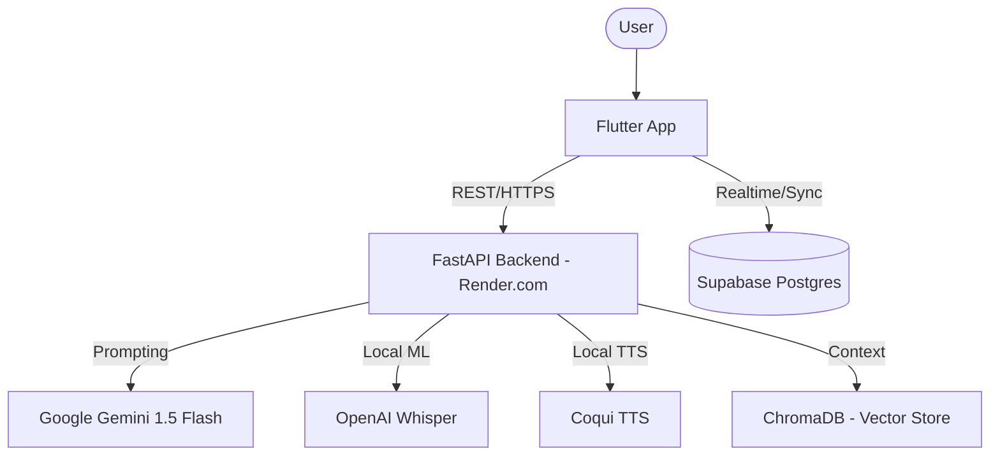

# 04 - System Architecture

## 1. High-Level Overview
SpeakUp is built on a distributed **Three-Tier Architecture**:
- **Presentation Layer:** Cross-platform Flutter client.
- **Logic Layer:** FastAPI (Python) backend handling heavy ML/NLP tasks.
- **Data Layer:** Supabase (BaaS) providing Auth, Realtime Postgres, and Storage.

## 2. Infrastructure Diagram (Simplified)

## 3. Technology Stack
| Layer | Technology | Purpose |
|---|---|---|
| **Frontend** | Flutter, Riverpod, Dio | UI, State Management, API Communication |
| **Backend** | FastAPI, Python 3.11 | High-performance async service layer |
| **ML/STT** | OpenAI Whisper (Local) | Speech-to-Text translation |
| **ML/TTS** | Coqui TTS (Local) | Natural voice synthesis |
| **LLM** | Gemini 1.5 Flash (Primary) | Coaching intelligence & feedback |
| **Fallback** | Groq (Llama 3.1 70B) | LLM availability guard |
| **Database** | Postgres (Supabase) | Structured data & RLS |
| **Vector DB** | ChromaDB (Local) | Semantic search for RAG context |

## 4. Operational Workflows
### Voice Turn Pipeline
1. **Flutter:** Encodes audio (16kHz WAV) -> POSTs to `/sessions/turn`.
2. **FastAPI:**
   - Transcribes with Whisper.
   - Extracts acoustics with Librosa.
   - Analyzes grammar via LanguageTool.
   - Generates response with Gemini.
   - Synthesizes audio with Coqui.
3. **Flutter:** Decodes and plays AI audio; updates UI with new scores.

## 5. Scalability & Deployment
- **Client:** Optimized for mobile (Android/iOS) and Web.
- **Backend:** Scalable instances on Render.com (initial free tier).
- **Storage:** Supabase Storage handles audio file backups and large JSON logs.
